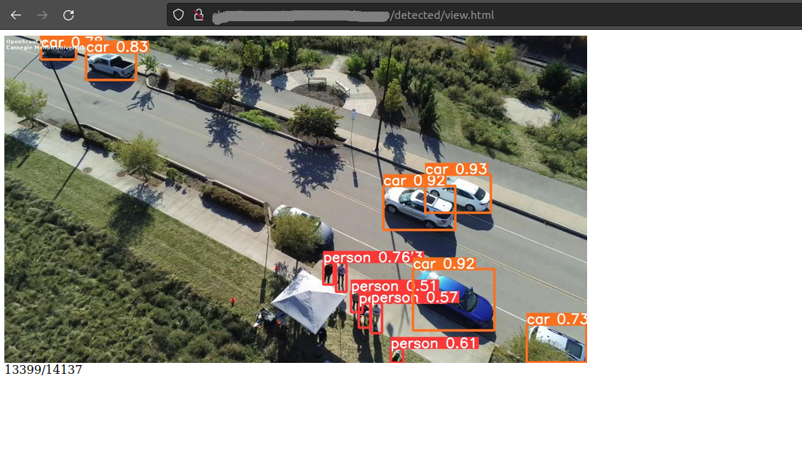
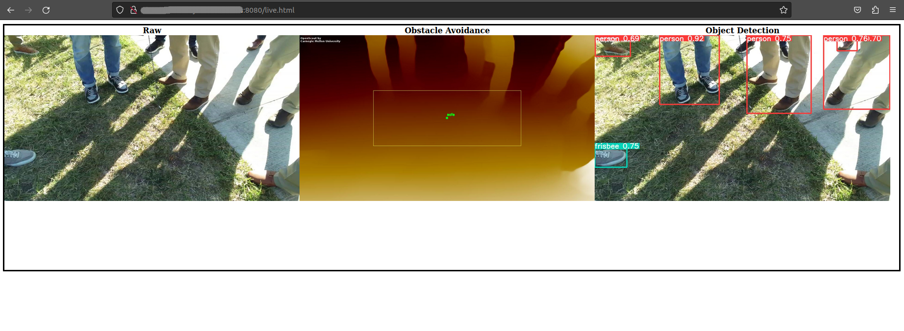
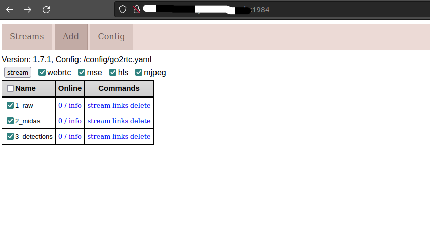

# Command and Control Server

## Description

The command and control server (CNC for short), is used to communicate with both drones in the field, and commanders who wish to remotely control those drones. CNC leverages [gabriel](http://github.com/cmusatyalab/gabriel) to manage client connections, send serialized data back and forth, and perform flow control. A gabriel server has one or more cognitive engines that perform paritcular tasks on some sensor data from clients. In the case of CNC, there is one new cognitive engine: telemetry. The telemetry engine is responsible for pushing telemetry data into Redis, relaying the current images to any connected commanders (via Reids pub/sub), and persisting imagery data to the shared steeleagle-vol volume (if started with the --store option which is enabled by default). A separate ZMQ REQ/REP-based control plane is used to communicate control messages from commander(s) to drone(s).

Steel Eagle leverages [OpenScout](https://github.com/cmusatyalab/openscout) and its object detection and face recognition engines. Additionally, the steel-eagle branch of the openscout repository adds an additional obstacle avoidance engine. It also utilizes the ELK containers that are part of OpenScout for later analysis. 

## Prerequisites

Docker and docker-compose must be installed. NVIDIA CUDA drivers must also be present on the host.  This [gist](https://gist.github.com/teiszler/3bdf9c2629ae49f2058977db11b07dfd) (or something similar) can be used to install docker, docker-compose, and CUDA.

## Usage

### Build/Obtain Docker Images

#### Pulling from Docker Hub

```sh
git clone git@github.com:cmusatyalab/steeleagle.git
docker pull cmusatyalab/steeleagle:latest
docker pull cmusatyalab/openscout:steel-eagle
```

#### Building images from source

```sh
git clone git@github.com:cmusatyalab/steeleagle.git
cd ~/steeleagle/cnc/
docker build . -t cmusatyalab/steeleagle:latest
git clone git@github.com:cmusatyalab/openscout.git
cd ~/openscout
git checkout steel-eagle
docker build . -t cmusatyalab/openscout:steel-eagle
```

### Configure docker-compose environment

In the `/steeleagle/cnc/server/` directory, there is a template.env file that can be used as an example docker-compose environment. Copy and then modify it to control things such as the confidence thresholds for the face and object engines, the initial DNN model to load, and the public URL for the webserver.

```sh
cd ~/steeleagle/cnc/server/
cp template.env .env
#edit .env file as necessary
```
* _DRONE_TIMEOUT_ - This value is used to control when the cnc server decides to invalidate a previously connected drone. If the drone hasn't sent any updates for this number of seconds, it will be considered lost.
* _TAG_, _OPENSCOUT_TAG_ - These values should match the tags used to build the containers in the previous section (TAG=latest, OPENSCOUT_TAG=steel-eagle)
* _STORE_ - When this is '--store', all incoming images will be stored to a docker volume (steeleagle-vol). Additionally, the output from the object detection and obstacle avoidance engines will be stored in subdirectories ('detected' and 'moa' respectively).
* _HTTP_PORT_, _WEBSERVER_URL_ - These URL and port variables are used to expose the aforementioned image directories via an Apache webserver.
* _FACE_THRESHOLD_ - The confidence threshold for the face recognition engine. Only matches above this threshold will be returned.
* _DNN_, _OBJ_THRESHOLD_, _EXCLUSIONS_ - Object Detection engine parameters. DNN specifies the name (lefthand portion) of the pytorch model (.pt) to use. This model should reside in the /models subdirectory. The object threshold specifies the confidence threshold for the object detection engine. The exclusions parameter is a comma-separated list of classes (integer representation) to exclude when returning detections. For example, when using a COCO-based model, EXCLUSIONS=1 would prevent 'person' from being returned by the DNN.
* _MIDAS_ - Specifies which MiDaS model to use. Valid values for _MIDAS_ are listed below.  DPT_Large seems to provide a good balance between inference speed and accuracy. Please refer to the [MiDaS documentation](https://github.com/isl-org/MiDaS#Accuracy) for more details about the different models.
  * 'DPT_BEiT_L_512'
  * 'DPT_BEiT_L_384'
  * 'DPT_SwinV2_L_384'
  * 'DPT_SwinV2_B_384'
  * 'DPT_SwinV2_T_256'
  * 'DPT_Swin_L_384'
  * 'DPT_Next_ViT_L_384'
  * 'DPT_LeViT_224'
  * 'DPT_Large'
  * 'DPT_Hybrid'
  * 'MiDaS'
  * 'MiDaS_small'
* _DEPTH_THRESHOLD_ - This configures how many layers to ignore when determining whether obstacles are imminient (0-255). We have found that 150 is pretty reasonable for low speeds. 

### Explanation of Services

The docker-compose.yaml file specifies several services that run as part of the steeleagle backend. It is useful to understand what each container is responsible for in order to find information and debug issues.

1. **gabriel-server** - Core gabriel server container. Responsible for managing connections between clients (drones, commanders0 and cognitives engines (telemetry, object detection, obstacle avoidance).
2. **telemetry-engine** - Used for storing telemetry data from connected drones in redis and persisting imagery (if started with the --store flag).
3. **http-server** - Exposes the /steeleagle-vol direcetory so that images for the various engines can be viewed for troubleshooting.
4. **openscout-face-engine** - Handles face recognition on the incoming stream by making calls to the openface-service.
5. **obstacle-engine** - Uses MiDaS to determine where obstacles are within the frame and returns a vector to the drone to navigate away to safe space.
6. **openscout-object-engine** - Performs object detection using a pytorch model.
7. **openface-service** - Small REST Wrapper for OpenFace.
8. **redis** - For storage of flight data. Referenced by commanders.
9. **go2rtc** - A webRTC frontend that allows for streamlined viewing of the data in /steeleagle-vol.
10. **control-plane** - A ZMQ REQ/REP channel for sending control messages from commander(s) to drone(s).

### Redis preparation

By default, Redis is insecure. We must first alter the Redis configuration to disable the default user and create a steeleagle user with a secure password. First, edit the [redis.conf](https://github.com/cmusatyalab/steeleagle/blob/main/cnc/server/redis.conf) template by supplying a password for the steeleagle user in the section of redis.conf shown below:

```conf
user default reset
user steeleagle on allcommands allkeys allchannels >(use secure password here)
```

A key can be generated by using gpg or openssl, for example:

```sh
gpg --gen-random 2 20 | base64
```

The rate at which snapshots are made by Redis can be controlled by editing the following section of the config file:

```conf
# Unless specified otherwise, by default Redis will save the DB:
#   * After 3600 seconds (an hour) if at least 1 key changed
#   * After 300 seconds (5 minutes) if at least 100 keys changed
#   * After 60 seconds if at least 10000 keys changed
#
# You can set these explicitly by uncommenting the three following lines.
#
# save 3600 1
# save 300 100
# save 60 10000
```

Once the changes have been made to redis.conf, this file will need to be copied into the steeleagle-vol/redis/ directory where it will be read the next time the redis container is restarted. This directory will also be the location where the snapshot (dump.rdb) file will be stored.

### Models

Before we launch the containers, we first need to download the models for the object detection and obstacle avoidance cognitive engines. The models need to be placed into the ```steeleagle/cnc/server/models``` directory. For object detection, any YOLOv5 pytorch model should work. Pretrained models can be downloaded [here](https://pytorch.org/hub/ultralytics_yolov5/). For MiDas, pretrained models will automatically be downloaded the first time the container launches. See above for the valid values for _MIDAS_ in the .env file.

{: .note}

The name (left-hand side) of the model must match what is configured in your .env file for _DNN_ and _MIDAS_.

### Launch containers with docker-compose

To launch all the containers and interleave the output from each container in the terminal:

```sh
cd ~/steeleagle/cnc/server
docker-compose up
```

If you wish to launch the containers in the background, you can pass the -d flag to docker compose. You can then use docker logs to inspect what is happening to individual containers.

```sh
cd ~/steeleagle/cnc/server
docker-compose up -d
```

If you run the containers in the background, you can view the logs with the following command:

```sh
docker-compose logs -f 
```
If you wish to see a particular log, you can specify a particular service(s):

```sh
docker-compose logs -f command-engine,gabriel-server
```

### Deubging/Troubleshooting

In the field, it is often useful to have an ssh connection to the backend server open that is displaying the logs of the docker containers running there. When particular services are not specified, ```docker-compose logs -f``` will interleave the logs messages from all of the running containers which can be difficult to read. It is often helpful to only look at a subset of the logs. For example, to look at only the cognitive engine logs use ```docker-comopse logs -f command-engine,openscout-object-engine,obstacle-engine```.  It is also helpful to see in real-time what the processed image frames look like. To do this, you will need to copy some HTML files from the ```steeleagle/cnc/``` directory into ```steeleagle/cnc/server/steeleagle-vol``` directory. Alternatively, the docker-compose file will launch a go2rtc container which can be configured to serve the updates to these image directories with WebRTC.

{: .note}

The steeleagle-vol directory will not exist until the containers are launched for the first time and **only** if the STORE=--store variable is set in the .env file.

#### view.html

[view.html](https://github.com/cmusatyalab/steeleagle/blob/main/cnc/view.html) can be copied into any/all of the following 3 directories: raw/<drone_name>/<flight_dir>, detected, and moa. One can then navigate to http://host:8080/<1 of 3 dirs>/view.html where the directory of images can be iterated through using the left/right arrow keys. Below the current image will be displayed the current image nubmer and the total number of images in the directory.



#### live.html

[live.html](https://github.com/cmusatyalab/steeleagle/blob/main/cnc/live.html) can be copied into any steeleagle-vol/raw/<drone_name> subdirectory. One can then navigate to http://host:8080/raw/<drone_name>/live.html. This will display the latest raw image, obstacle avoidance output, and object detection output. 

{: .note}

The object detection engine will only output an image if one of the classes is detected above the specified threshold, therefore it will not update as frequently as the other images.



#### go2rtc

[go2rtc](https://github.com/AlexxIT/go2rtc) can be configured to serve the same images as view/live.html but will do so using webrtc.  The go2rtc container will look for a configuration file in ~/go2trc/go2rtc.yaml. Below is configuration for our purpose:

```yaml
streams:
  # [JPEG] snapshots from Dahua camera, will be converted to MJPEG stream
  1_raw: http://localhost:8080/raw/<drone_name>/latest.jpg
  2_midas: http://localhost:8080/moa/latest.jpg
  3_detections: http://localhost:8080/detected/latest.jpg
```

Once configured, navigate to http://host:1984 and select the streams to view and click the stream button. The streams will be rendered in a similar fashion as live.html.


